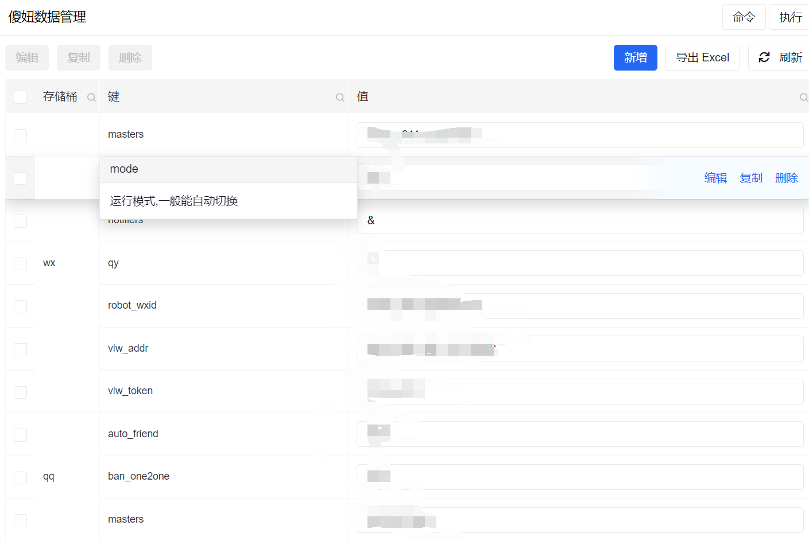
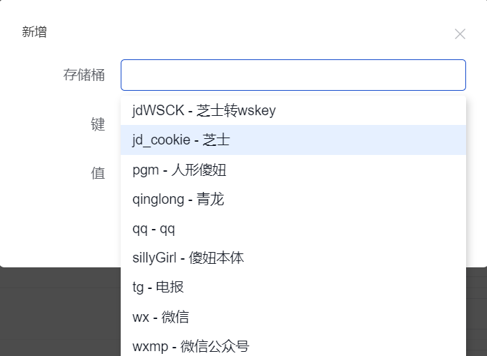
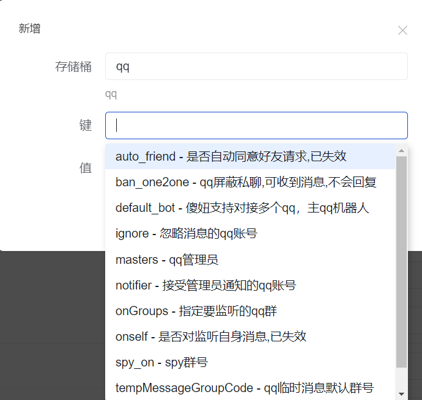

# 傻妞web插件

## 使用方式

解压并放入生成的`./plugin/web/`目录即可,所有插件安装后需要重启

当使用名称为xxx的插件时,将文件放入`./plugin/web/yyy`,重启傻妞并访问 `http://ip:端口/yyy`即可  
也就是说,访问路径为文件夹路径

### admin

傻妞变量管理工具

默认用户名: admin
重置密码: set sillyGirl adminPassword 密码
无密码时会产生随机密码,请在日志中查看

2022.04.05:
新增提示相关功能
2022.04.21:
完善提示相关功能,优化体验
2022.05.19:
利用新api获取傻妞中所有数据,增加获取数据上限,避免网页响应太慢
2022.06.11:
优化体验,增加命令相关提示
